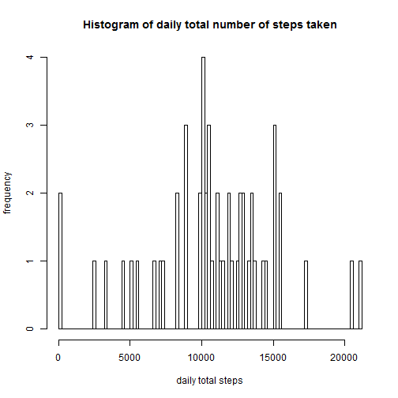
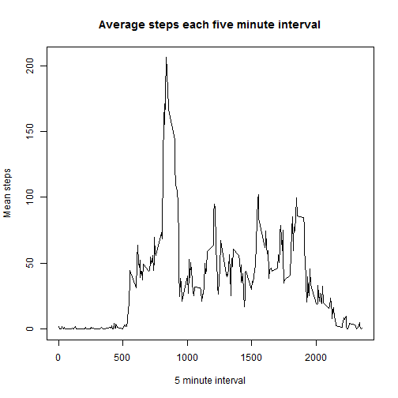
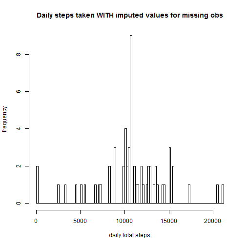
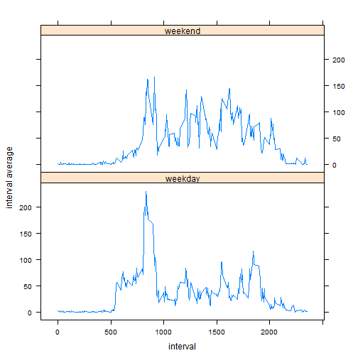

# Reproducible Research: Peer Assessment 1
This is TBLackey's assignement for the Reproducible Research Assignment 1 on Coursera

This assignment investigates data on the number of walking steps taken by a person over a two month period.

The following packages are useful for this investigation:


```r
require(timeDate)
```

```
## Loading required package: timeDate
```

```r
require(lattice)
```

```
## Loading required package: lattice
```


## Loading and preprocessing the data

The activity data is then read into R, and a clean data set is created with null values removed. For convenience the date is converted to the R date data type:


```r
data<-read.csv("activity.csv")
data$date<-as.Date(data$date)
good<-complete.cases(data)
cleandata<-data[good,]
```


## What is mean total number of steps taken per day?

Next a histogram of the total daily number of steps taken is created:


```r
dailysum<-do.call(rbind,as.list(sapply(split(cleandata$steps,cleandata$date),sum)))
hist(as.numeric(dailysum),breaks=100,main=("Histogram of daily total number of steps taken"),ylab="frequency",xlab="daily total steps")
```

 

The mean daily total number of steps is then calculated:


```r
meansteps<-mean(as.numeric(dailysum))
```

The mean total daily steps is 1.0766 &times; 10<sup>4</sup>.

And then the median is calculated:


```r
mediansteps<-median(as.numeric(dailysum))
```

The median total daily steps is 1.0765 &times; 10<sup>4</sup>.

## What is the average daily activity pattern?
The mean number of steps on each five minute interval of the day is then plotted:


```r
intervals<-data.frame(unique(cleandata$interval))
colnames(intervals)<-"interval"

fiveminutemean<-data.frame((sapply(split(cleandata$steps,cleandata$interval),mean)))
colnames(fiveminutemean)<-"fiveminutemean"

fiveminutedf<-cbind(intervals,fiveminutemean)
plot(fiveminutedf[[1]],fiveminutedf[[2]],type="l",main="Average steps each five minute interval",xlab="5 minute interval",ylab="Mean steps")
```

 

The five minute interval that on average had the most number of steps was then calculated:


```r
maxinterval<-fiveminutedf[which.max(fiveminutedf[,2]),]
```

The daily five minute interval with the highest average number of steps is at 0835 hours.

## Imputing missing values
The activity data has the following amount of missing observations:


```r
missingna<-length(which(is.na(data$steps)))
```

The number of missing observations is 2304.

A strategy to deal with missing values was then considered:

The missing data was replaced with imputed values, using the mean average previously calculated for that five minute interval:


```r
dataimputed<-data
dataimputed<-cbind(dataimputed,fiveminutedf$fiveminutemean)
dataimputed$steps<-replace(dataimputed$steps,is.na(dataimputed$steps),fiveminutedf$fiveminutemean)

dailysumimputed<-do.call(rbind,as.list(sapply(split(dataimputed$steps,dataimputed$date),sum)))
```

A new histogram of the daily total was then calculated:


```r
hist(as.numeric(dailysumimputed),breaks=100,main=("Daily steps taken WITH imputed values for missing obs"),ylab="frequency",xlab="daily total steps")
```

 

The mean and median daily total number of steps, including the imputed values is then calculated. Imputing the missing values by applying the five minute means pushes the daily median towards the daily mean:


```r
meanstepsimputed<-mean(as.numeric(dailysumimputed))
```

The revised mean daily total is 1.0766 &times; 10<sup>4</sup>.


```r
medianstepsimputed<-median(as.numeric(dailysumimputed))
```

The revised median daily total is 1.0766 &times; 10<sup>4</sup>.

## Are there differences in activity patterns between weekdays and weekends?

Finally an investigation was made in the difference in behaviour between weekdays and weekends:


```r
weekdayorend <- data.frame(sapply(dataimputed$date,FUN=function(x) { if ( isWeekday(x) ) {as.factor("Weekday") } else {as.factor("Weekend")}}))
colnames(weekdayorend)<-"weekdayorend"
dataimputed<-cbind(dataimputed,weekdayorend)

dataimputedweekday<-subset(dataimputed,weekdayorend=="Weekday")
dataimputedweekend<-subset(dataimputed,weekdayorend=="Weekend")

weekdayfiveminutemean<-data.frame((sapply(split(dataimputedweekday$steps,dataimputedweekday$interval),mean)))
weekdayfiveminutemean<-cbind(intervals,weekdayfiveminutemean,"weekday")
names(weekdayfiveminutemean)[2]<-"fiveminutemean"
names(weekdayfiveminutemean)[3]<-"weekdayorend"

weekendfiveminutemean<-data.frame((sapply(split(dataimputedweekend$steps,dataimputedweekend$interval),mean)))
weekendfiveminutemean<-cbind(intervals,weekendfiveminutemean,"weekend")
names(weekendfiveminutemean)[2]<-"fiveminutemean"
names(weekendfiveminutemean)[3]<-"weekdayorend"

dataimputed<-rbind(weekdayfiveminutemean,weekendfiveminutemean,deparse.level=0)
```

The results are in the following plots:


```r
xyplot(fiveminutemean ~ interval | weekdayorend, data = dataimputed, layout = c(1, 2),type="l",ylab="interval average") 
```

 


